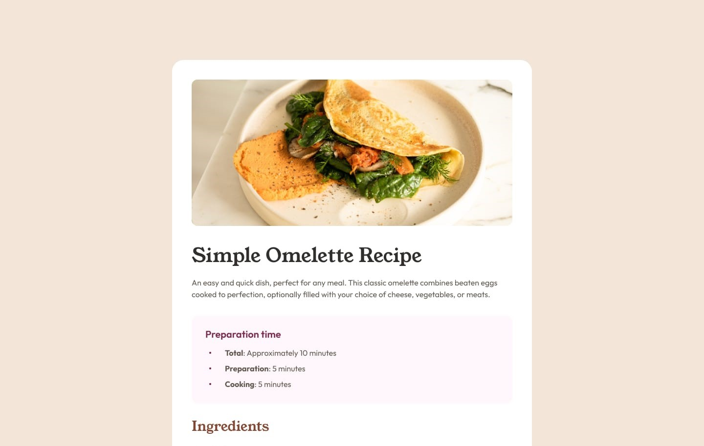

# Frontend Mentor - Recipe page solution

This is a solution to the [Recipe page challenge on Frontend Mentor](https://www.frontendmentor.io/challenges/recipe-page-KiTsR8QQKm). Frontend Mentor challenges help you improve your coding skills by building realistic projects.
  

## Table of contents

  

- [Overview](#overview)

- [Screenshot](#screenshot)

- [Links](#links)

- [Author](#author)

- [Usful line](#usful-line)

## Overview

### Screenshot
 
  
### Links

- Solution URL: [Add solution URL here](https://github.com/wldeu/Frontend-Mentor-Challenges-Collection/tree/main/recipe-page)

- Live Site URL: [Add live site URL here](https://wldeu.github.io/Frontend-Mentor-Challenges-Collection/recipe-page/)

  

### Usful line
- https://www.w3docs.com/snippets/html/how-to-control-the-space-between-bullets-and-li-elements.html

- https://stackoverflow.com/questions/13624276/how-to-separate-table-rows-with-a-line/13624319#13624319?newreg=c64a9ac44dae4ce2bfebe72674386f7f

- https://developer.mozilla.org/en-US/docs/Learn/HTML/Tables/Basics

## Author

<!-- Website - [weldu.github.io](wldeu.github.io) -->

- Frontend Mentor - [@wldeu](https://www.frontendmentor.io/profile/wldeu)

- Github- [@wldeu](https://www.github.com/wldeu)
